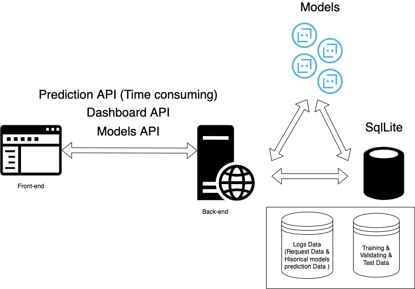

# Fraud Detection Application for Real-time Credit Card Transactions
 
**Dataset**: [IEEE-CIS Fraud Detection on Kaggle](https://www.kaggle.com/c/ieee-fraud-detection)

The dataset we are going to use describes the features of  online transactions made by  credit/debit cards. The data is broken into two files: identity and transaction, which are joined by TransactionID.  The identity file describes the features of a transaction, like: time, amount, product, address, and etc.. The identity file stores records for network connection information (IP, ISP, Proxy, etc) and digital signature associated with transactions.
 
The dataset is provided by Vesta Corporation, which is the forerunner in guaranteed e-commerce payment solutions. And can be found on [Kaggle](https://www.kaggle.com/c/ieee-fraud-detection/overview).
 

## Project Description:

Our capstone project focuses on building a full-stack fraud detection application from end to end. The detection engine will predict real-time credit card transactions and make a low-latency prediction. This project explores the connections between different stages throughout a data science project including data collection, preprocessing, modeling, and model deployment. Moreover, we are planning to integrate the fraud prediction product with web application development and provide a web-based interactive console to manage the whole pipeline. 
 
A list of Python/Javascript Files:
1. DataCleaning.py
2. 2_EDA_code_.py:  Exploratory data analysis (EDA folder)
3. Model Building—SupervisedLearning.py: Python program of supervised learning models.(model folder)
4. 4_pca_and_kmeans_code.py: Python program of PCA and K-Means clustering models.  (model folder)
5. 5_hierarchical_clustering_and_dbscan_code.py: Python program of hierarchical clustering and DBSCAN clustering models. (model folder)
6. Full-stack Development (Javascript)
 
 
## How to Install and Run the Application:
### Approach A: direct installation
The complete application needs a python based backend server and a simple reactjs fronend server.

[Nodejs](https://nodejs.org/en/download/) and Python runtime are required to run this application
#### Frontend server installation
1. Make sure your instance has [npm](https://www.npmjs.com/package/npm) installed
2. Launch frontend server
2.1 under the root(capstone-fraud-detection) folder level, firstly go to server folder or run `cd server`
2.2 if using `npm`, run `npm start`
#### Backend server installation
We are using [Poetry](https://python-poetry.org/docs/) to manage the dependencies versins, but we also provided `requirements.txt` to help users to install dependencies without poetry
1. run `cd backend` and `pip install -r requirements.txt`
2. run `python server.py` to start the backend server
#### SQLite Server loopup
The sqlite is managed by backend server automatically. This section is the instruction about how you can directly communicate with database if you want to query the data or have a look at the table structures.
1. At `root` level, `cd backend/schemas`
2. Enter the syslog.db using `sqlite3 syslog.db`
3. use `.tables` could show all available tables here
syslog.schema contains all the schmas that our application used
### Approach B: Containerlized installation
#### install docker and docker-compose
[docker setup tutorial](https://docs.docker.com/get-docker/)
[docker-compose setup](https://docs.docker.com/compose/install/)
#### use docker-compose to launch the container clusters
Under root folder level, run `docker-compose build` to build all the images needed. The Dockerfile are located in each subfolder.
After images built, run `docker-compose up` to start the cluster. (You can also run `docker-compose up -d` to start cluster in the backgroud)
If you want to stop the application, run `docker-compose down` to stop tasks.
## Best Detection Model: (model structure explained with graph)
Coming Soon….
 
 
## Dashboard:

Our dashboard design included a timer, real time server status card, donut chart to indicate total authentic vs. fraud cases counts. The second row are composed of a stacked bar chart to present the information of each models historical data and a world map plot to indicate users distribution. 

## Models

Model provides the service to let user upload new model they want to use to predict trasaction and our application will utilize our data pipeline to automatically load training data and train the model and print out the validation scores. The model now is constrained as the model which extends from sklearn. (We need to call predict, score methods)
For the later on development, the model status tracking could be added to this page and also present the trainig results to this page.
## APIs
<table> 
<tr>
<th>API</th>
<th>Parameters</th>
<th>Description</th>
<th>Examples</th>
<th>Example Result</th>
</tr>
<tr>
<td>/search_model</td>
<td>model</td>
<td>The name of the model, the modelname is case insensitive</td>
<td>localhost:5000/search_model?model=decisiontree</td>
<td>
<pre>
{
  "result": [
    [
      17, 
      "desiciontree", 
      0
    ], 
    [
      5, 
      "desiciontree", 
      1
    ]
  ]
}
</pre>
</td>
</tr>
<tr>
<td>/summary</td>
<td>-</td>
<td>Get the summary of prediction data, the response will include counts of authentic result and fraud result</td>
<td>http://localhost:5000/summary</td>
<td><pre>
{
  "auth_cnt": 19, 
  "fraud_cnt": 78
}
</pre></td>
</tr>
<tr>
<td>/usersgeo</td>
<td>-</td>
<td>get the user geographical data in the format of [longitude, latitude]</td>
<td>http://localhost:5000/usersgeo</td>
<td><pre>
{
  "result": [
    [
      -77.0, 
      38.8833
    ], 
    [
      -77.0, 
      38.8833
    ], 
    ...
  ]
}
</pre></td>
</tr>
<tr>
<td>/prediction</td>
<td>data,   model</td>
<td>pass in the data and modelname, the server will return back the result predicted by designated model. If the model is not passed in, the backend server will return results by all models in database. The data will be passed in the request body</td>
<td></td>
<td><pre>
{
	"randomforest": 0,
	"desiciontree": 1,
	"xgbooster": 0
}
</pre></td>
</tr>
</table>

## Possible approaches to do in the future work/Future Plan:
 
Based on our unsupervised learning model results, the optimal number of clusters is 3.  This is very interesting becuase in the original dataset provided there are only two labels for transactions-fraud and non-fraud. We plan to investigate further on what the three clusters generated by unsupervised learning models are. We are interested to know whether there are two types of fraud transactions or two types of non-fraud transactions.

